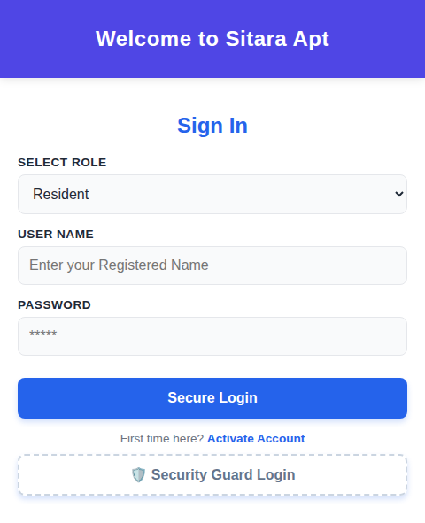
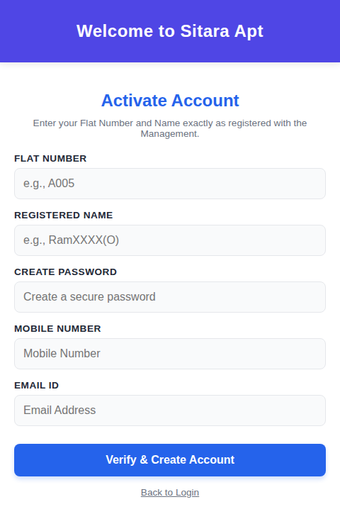
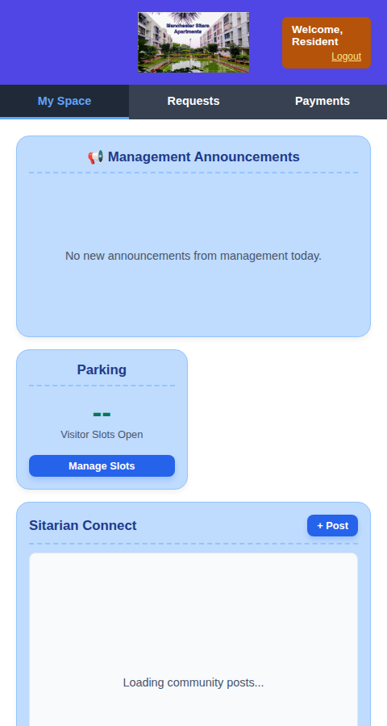
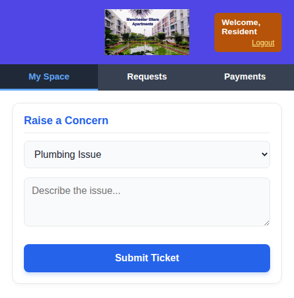
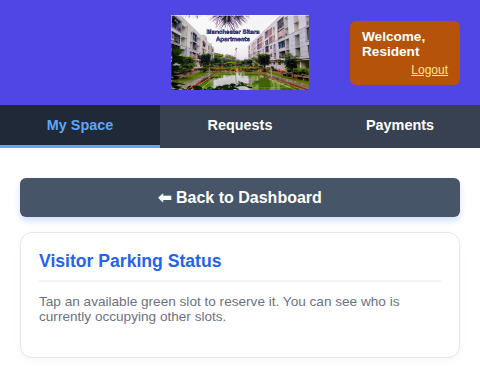

<p align="center">
  
</p>

<h1 align="center">Sitara Residence — Community Management Platform</h1>

<p align="center">
  A mobile-first, single-page web app for running a residential society: billing, payment verification, community announcements, visitor parking, and gated visitor entry — all backed by Supabase.
</p>

---

# Overview

Sitara Residence is a lightweight portal built for **Manchester Sitara Apartments** to replace the usual mix of WhatsApp groups, paper registers, and spreadsheets that most housing societies run on. It gives residents a single place to pay dues, raise maintenance tickets, read management notices, and manage visitor parking, while giving the management committee and gate security their own dedicated workflows.

The entire front end is a single `index.html` file — plain HTML, CSS, and JavaScript, no build step, no framework. All data, auth, and file storage are handled by **Supabase** (hosted Postgres + Auth + Storage), so the client only ever talks to Supabase's REST/JS SDK.

# Tech Stack

| Layer | Technology |
|---|---|
| Front end | Vanilla HTML5, CSS3 (custom, no framework), vanilla JavaScript |
| Backend / BaaS | [Supabase](https://supabase.com) — Postgres database, Supabase Auth, Storage, Edge Functions |
| Scheduling | `pg_cron` (via a Supabase Edge Function) for nightly cleanup jobs |
| Auth model | Email/password via Supabase Auth, with usernames mapped to synthetic auth emails |
| Data access control | PostgreSQL Row Level Security (RLS) policies |

No `package.json`, bundler, or Node server is required to run the app — it's a static page that talks directly to a Supabase project over HTTPS.

---

# Project Setup

1. **Clone the repository:**

   ```bash
   git clone https://github.com/Manovishaal/Sitara-Residence-application.git
   cd Sitara-Residence-application
   ```

2. **Create a Supabase project** at [supabase.com](https://supabase.com) and grab your **Project URL** and **anon/public API key** from *Project Settings → API*.

3. **Set up the database.** In the Supabase SQL editor, create tables for residents/flats, notices, payments, parking slots, and gate/visitor logs, then enable **Row Level Security** on each and add policies that scope reads/writes to the authenticated user's `FlatNo` (see [Security Architecture](#security-architecture) below).

4. **Deploy the cleanup job.** Add a Supabase Edge Function that purges expired community posts, and schedule it with `pg_cron` to run nightly at midnight.

5. **Point the app at your project.** Open `index.html` and replace the `SUPABASE_URL` and `SUPABASE_ANON_KEY` constants near the top of the `<script>` block with your own project's values.

## Running the Project

Because there's no backend server or build step, you can run the app any way you'd serve a static file:

```bash
# Option 1 — just open it
open index.html          # macOS
start index.html         # Windows

# Option 2 — serve it locally (recommended, avoids file:// CORS quirks)
npx live-server .
# or
python3 -m http.server 5500
```

Then visit the served URL (e.g. `http://localhost:5500`) in a mobile-width browser window or on an actual phone — the UI is designed around a 480px-wide card.

## Project Structure

```
Sitara-Residence-application/
├── index.html        # Entire front-end app: markup, styling, and Supabase client logic
├── Sitara1.png        # Apartment logo shown in the in-app header
├── screenshots/        # Screens referenced in this README
└── README.md
```

Everything — routing between screens, form handling, Supabase queries, toast notifications, and the parking timer — lives inside `index.html`, split into a `<style>` block, the view markup, and a single `<script>` block of plain JS functions attached to `window`.

---

# Core Features

### Secure Authentication
Residents and admins sign in through a role-aware login form backed by Supabase Auth. Usernames are mapped to synthetic auth emails behind the scenes so the Management doesn't have to distribute real email accounts to every flat. First-time users go through an **Activate Account** flow that validates their flat number and registered name before a password is set.

### Dynamic Billing System
Admins can issue a single global payment request (e.g. Annual Maintenance) that appears on every resident's dashboard, or upload a CSV (`FlatNo, Maintenance, Water, Genset, Total`) to instantly generate individual monthly utility bills per flat.

### Approval Workflow
Residents mark a bill as paid and submit a payment reference, which lands in a **Pending** queue. From the Admin Hub's Treasurer Verification panel, the committee cross-checks the reference against the bank statement before flipping the record to **Verified**.

### Sitarian Connect (Community Feed)
A lightweight social feed on the resident dashboard where residents and admins can post updates with an optional photo (captured via camera or picked from the gallery, auto-compressed client-side before upload).

### Automated Timeline Management
A Supabase Edge Function on a `pg_cron` schedule sweeps expired community posts and notices every night at midnight, so the noticeboard stays current without any manual housekeeping.

### Visitor Parking
A live grid of visitor parking slots. Available slots can be reserved by any resident; occupied slots show a running timer and a self-service **Checkout** button to vacate.

### Gate Security & Visitor Management
A separate tablet-facing login for the gate security team, with an **In-Gate** post for logging new arrivals (Guests and Vendors) and an **Out-Gate** post for recording vehicle departures. Residents can also pre-approve an expected visitor from their own dashboard so security sees them on arrival.

### Admin Hub
A consolidated committee console for posting notices (with image upload), issuing payment intimations with a UPI QR code and/or bank portal link, distributing bills via CSV, and verifying pending payments — all in one view.

---

# Security Architecture

- **Row Level Security (RLS):** The PostgreSQL database is locked down at the kernel level. RLS policies cross-reference the authenticated user's Supabase Auth token with their assigned `FlatNo` on every query.
- **Strict data isolation:** Residents can only read and write their own financial history. Cross-tenant requests are rejected by the database itself, not by client-side checks.
- **Protected tables:** Security rules live in the database rather than in the front-end HTML/JS, so a malicious or tampered client script has no path to altering or deleting financial records — the database is the enforcement point, not the browser.

---

# Screens

## Sign In


Role-aware login (Resident / Admin) with a dedicated entry point for Security Guard login.

## Activate Account


First-time residents register with their flat number and management-verified name before setting a password.

## Resident Dashboard — My Space


Management announcements, live visitor-parking availability, and the Sitarian Connect community feed, all on one screen.

## Maintenance Requests


Residents log plumbing, electrical, cleaning, or other issues directly to management.

## Visitor Parking


Reserve an open slot or check out of one you're currently occupying, with a live occupancy timer.

## Payments, Admin Hub & Gate Security
The Payments tab (bill history and payment verification), the Admin Hub (notices, billing, CSV upload, Treasurer verification), and the Gate Security console (guard login, arrivals/departures logging) are all implemented in `index.html` — see [Core Features](#core-features) above for what each does. Screenshots for these will be added once a layout regression noted below is fixed.

---

# Known Issues

- **Layout regression on Payments / Admin Hub / Security views:** an extra closing `</div>` around line 336 of `index.html` closes `.app-container` early, which pushes everything after the Requests view (Payments, Admin Hub, Security Login, Security Gate) outside the centered 480px app shell. The markup and logic for those screens are otherwise complete — this is a one-tag fix.
- **Gate entry protocols:** visitor/gate logging is implemented (`submitGateEntry`, `loadActiveGateLogs`, guard login), but the feature is still being hardened for a full rollout as a safer entry system for residents.

# Roadmap

- Fix the `.app-container` nesting bug above.
- Finish and QA the Gate Entry / visitor-log workflow end to end.
- Add automated tests around the CSV billing importer and payment verification flow.

---

<p align="center">Built for the residents of Manchester Sitara Apartments.</p>
